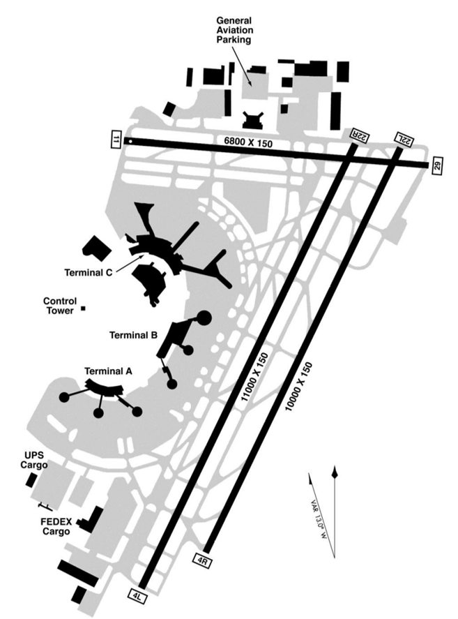
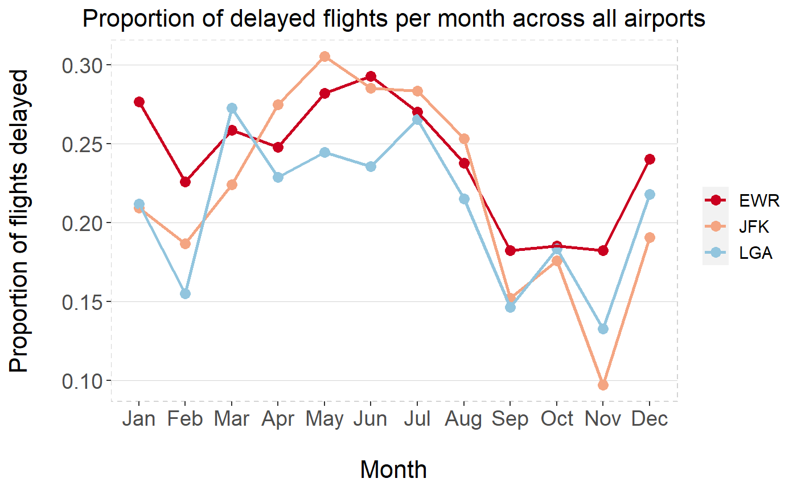

# **Newark Aiport (EWR) Flight Delays in 2017**

By Mandip Farmahan (2023-06-21)

<br>

This project was completed using both **R (RStudio)** and **Python (Jupyter Notebooks)**.

------------------------------------------------------------------------

## Project description

*"You have been hired by Newark Liberty International Airport to
investigate the effect of weather on aeroplane departure delays. They
want to invest in improving facilities so that aircraft can take off in
more types of weather. As part of investigating the effect of weather
you should investigate other factors to understand how important weather
is in comparison to them."*

<br>

There are three main airports in the New York/New Jersey area:

-   Newark Liberty International Airport (EWR);
-   John F. Kennedy International Airport (JFK);
-   LaGuardia Airport (LGA).


<br>

### Scope of project

The main sources of reported delay are weather, available runway slots
and flight paths (all three airports in the area share the same
airspace). The scope of this project therefore focused on the following:

-   How many flights were affected and was this different from the
    neighbouring airports (JFK and LGA)?
-   Were these delays weather related and if so, what elements were
    causing these delays?
-   If not weather related, what other factors were causing these
    delays?

<br>

### Domain knowledge (EWR Airport)

-   Opened in 1928;
-   There are three terminals and three runways:
    -   11/29 is used by smaller aircraft or when there are strong
        crosswinds on the two main runways;
    -   4R/22L (opened 1952) is used primarily for landings;
    -   4L/22R (opened 1970) is used primarily for departures;
    -   Port Authority completed a \$97 million USD rehabilitation
        project of 4L/22R in 2014
-   EWR was previously a FAA-designated Level 3 (slot-coordinated)
    airport;
-   In 2016, FAA re-designated EWR a Level 2 (schedule facilitated)
    airport.

<p align="center">

</p>

<br>

### Measure of delay

U.S. Department of Transportation Federal Aviation Administration (FAA)
Order JO 7210.55F states:

*"Reportable delays. Delays to instrument flight rules (IFR) traffic of
15 minutes or more, which result from the ATC system detaining an
aircraft at the gate, short of the runway, on the runway, on a taxiway,
or in a holding configuration anywhere en route must be reported."*

This project with therefore use a binary classification (delayed or not
delayed) using this 15 minute cut-off.

<br>

------------------------------------------------------------------------

## Datasets

Airport data, airline data, aeroplane data, flight data and weather data
in CSV file format were supplied as part of the project. The data sample
only covers a one-year period in the ninety-five years since the airport
was opened in 1928. This data is widely available through Kaggle and
there was no passenger information held within the supplied data files.
Therefore there are no ethical concerns regarding this data.

Approximately 2.6% of the dataset was missing departure times (across
all airports) so it was assumed that these flights were cancelled. There
were some unrealistic departure times within the dataset such as a
flight leaving approximately 90 minutes early. There was also a flight
which was recorded as leaving 26 hours late. The wide range in departure
times due to delays or leaving early favoured a binary classification
for determining the delay status.

In the weather datasheet, about 98% of the temperature, dew point,
humidity, precipitation and pressure data was missing. This was
supplemented with alternative sources of data. Supplementary data was
obtained from:

[Meteostat](https://meteostat.net/en/)

[National Centres For Environmental Information
(NOAA)](https://www.ncdc.noaa.gov/cdo-web/search?datasetid=GHCND)

<br>

------------------------------------------------------------------------

## Exploratory data analysis

The exploratory data analysis script
(`raw_data_file_and_variable_exploration.Rmd`) is located in the
`analysis_scripts/R` folder. The libraries required to run the
exploratory data analysis script are:

```         
library(geosphere)
library(GGally)
library(ggfortify)
library(here)
library(janitor)
library(tidyverse)
```

The analysis contained within this file guided the data cleaning script.

<br>

------------------------------------------------------------------------

## Data cleaning

The data cleaning script is located in the `cleaning_scripts` folder.
The libraries required to run the data cleaning script are:

```         
library(geosphere)
library(here)
library(janitor)
library(tidyverse)
```

<br>

The following data cleaning tasks were carried out:

-   Import the data from the CSV files;
-   Create a single date/time reference for each flight;
-   Extract weekday and cycle (morning, afternoon etc) for each flight;
-   Designate each flight as delayed or not delayed;
-   Calculate flights per day and flights per hour;
-   Add names and locations (longitude and latitude) for missing
    airports;
-   Join all of the datasets;
-   Calculate flight bearing based on origin (long/lat) and destination
    (long/lat);
-   Impute missing data using daily median for each airport;
-   Remove any non-essential columns;
-   Export clean data to CSV file.

<br>

------------------------------------------------------------------------

## Data Analysis

#### *Q. How many flights were affected and was this different from the neighbouring airports (JFK and LGA)?*

An initial investigation was conducted on the number of flights at
Newark Airport (EWR) and the proportion of those that were delayed:

<p align="center">

</p>

<br>

It should be noted that 40% of flights were in the morning, 30% were in
the afternoon, 25% were in the evening and 5% were at night. Therefore
the flight delays experienced in the morning had a knock-on effect on
flights throughout the day.

This was followed up with a cross-airport investigation.

<p align="center">

</p>

<br>

Statistical analysis was carried out to test if the proportion of delayed
flights at EWR was significantly higher than the proportion of delayed
flights at JFK and LGA (combined) across the year at a significance
level $\alpha = 0.05$.

$$H_0: \pi_{NewarkDelays} - \pi_{OtherDelays} <= 0$$

$$H_a: \pi_{NewarkDelays} - \pi_{OtherDelays} > 0$$

There was strong evidence to reject $H_0$ and conclude that the
proportion of delayed flights at EWR was significantly higher than the
proportion of delayed flights at JFK and LGA (combined) across the year.

<br>

Full details can be seen in `initial_analysis_on_flight_delays.Rmd`,
which is located in the `analysis_scripts/R` folder. This task was
completed using `RStudio`.

<br>

#### *Q. Were these delays weather related and if so, what elements were causing these delays?*

A diagnostic model was built using `Jupyter Notebooks` to determine the
impact of weather elements on flight departure delays:


<br>

Full details can be seen in `model_with_weather_only.ipynb`, which is
located in the `analysis_scripts/Python` folder.

<br>

#### *Q. If not weather related, what other factors were causing these delays?*

A predictive model was built using `Jupyter Notebooks` to predict
whether a flight departure would be delayed based on the following
weather and airport factors:


<br>

Full details can be seen in `model_with_final_vars.ipynb`, which is
located in the `analysis_scripts/Python` folder. This predictive model
was also trialled using data from the JFK and LGA airports with an AUC
of 0.694 and 0.720 respectively.

<br>

------------------------------------------------------------------------

## Conclusions

-   24% of flights from EWR in 2017 had departure delays.
-   Weather alone is not responsible for departure delays, therefore weather
    related airport improvements unlikely to cause a decrease in
    departure delays.
-   Time of flight and number flights per day are most important.
-   40% of flights are in the morning and only 5% at night, therefore flights
    should be more evenly spread across the day or reduce total number
    of flights.
-   Delays in general are worse at EWR than LGA and JFK, however more
    flights leave from EWR.
-   Final model indicates flights from all NY and NJ airports are
    affected by similar factors.

------------------------------------------------------------------------

## License

Distributed under the MIT License. See `LICENSE.txt` for more
information.
