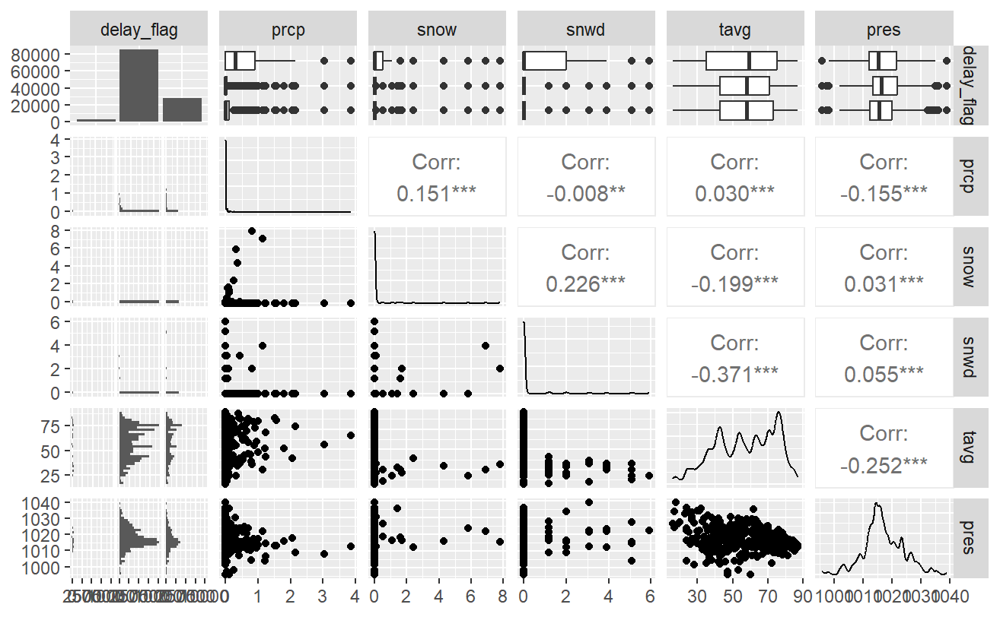

```{r, message=FALSE}
# import libraries
library(tidyverse)
library(here)
library(janitor)
library(GGally)
library(ggfortify)
library(geosphere)
```

```{r, message=FALSE}
# import datasets
airlines_df <- read_csv(here("data/raw_data/airlines.csv"))
airports_df <- read_csv(here("data/raw_data/airports.csv"))
flights_df <- read_csv(here("data/raw_data/flights.csv"))
planes_df <-  read_csv(here("data/raw_data/planes.csv"))
weather_df <- read_csv(here("data/raw_data/weather.csv"))

noaa_weather_df <- read_csv(here("data/raw_data/weather_noaa_ghcnd.csv")) %>% 
    clean_names()
meteostat_ewr <- read_csv(here("data/raw_data/weather_meteostat_ewr.csv"))
meteostat_jfk <- read_csv(here("data/raw_data/weather_meteostat_jfk.csv"))
meteostat_lga <- read_csv(here("data/raw_data/weather_meteostat_lga.csv"))
```

<br>

------------------------------------------------------------------------

# Combine datasets

## Flight details

### Initial inspection and check for missing values

```{r}
flights_df %>% 
  head()

flights_df %>% 
  count(origin)

flights_df %>% 
  count(dest)

flights_df %>%
  summarise(across(.cols = everything(),
                   .fns = ~sum(is.na(.x))),
            .by = c(origin))

flights_df %>%
  summarise(across(.cols = everything(),
                   .fns = ~sum(.x == 0, na.rm = TRUE)),
            .by = c(origin))

flights_df %>%
  summarise(across(.cols = everything(),
                   .fns = ~sum(is.na(.x))),
            .by = c(month))
```

Lots of missing dep_time values (2.6% of dataset) and they seem to be
spread across all airports and all months. This data cannot be imputed
as there is no similar to data to leverage, esp as these form the main
output measure. There also appears to be a few extra missing in the
dep_delay column. They will therefore be removed from the dataset.

```{r}
flights_df %>%
  filter(is.na(dep_time)) %>%
  filter(is.na(dep_delay))

flights_df %>%
  filter(!is.na(dep_time)) %>%
  filter(is.na(dep_delay))

flights_df %>%
  filter(abs(dep_delay) < 1)
```

Appears that these additional missing values should have been set to 0
based on dep_time minus sched_dep_time.

### First pass cleanup

The United States Federal Aviation Administration (FAA) considers a
flight to be delayed when it is 15 minutes later than its scheduled
time.

If there is no departure time, it is assumed that flight was cancelled.

```{r}
flights_final <- flights_df %>% 
  # create a single date/time reference for each flight
  mutate(sch_departure = ISOdate(year, month, day, hour, minute),
         .before = year) %>%
  # create a column for joining with additional weather dataset
  mutate(date = as.Date(paste(year, month, day), "%Y%m%d"),
       .before = year) %>% 
  mutate(dep_delay = case_when(is.na(dep_time) ~ NA, # cancelled flight
                               is.na(dep_delay) ~ 0, # no delay
                               .default = dep_delay),
         delay_flag = case_when(is.na(dep_time) ~ "Cancelled", # cancelled flight
                                dep_delay < 15 ~ "No", # no delay
                                .default = "Yes")) %>% 
  # extract only the columns required for final analysis
  select(sch_departure, origin, dest, dep_delay, delay_flag,
         carrier, flight, tailnum, distance,
         time_hour, date)

head(flights_final)
```

```{r}
flights_final %>% 
  count(delay_flag)
```

```{r}
flights_final %>%
  summarise(across(.cols = everything(),
                   .fns = ~sum(is.na(.x))),
            .by = c(origin))

flights_final %>%
  summarise(across(.cols = everything(),
                   .fns = ~sum(.x == 0)),
            .by = c(origin))

flights_final %>% 
  select(-c(sch_departure, time_hour, date)) %>% 
  summary()
```

From the dep_delay summary, it looks like some flights took off almost
1.5 hours early!

#### Plot the spead of delays

```{r}
# all flights
flights_final %>% 
  ggplot(aes(x = dep_delay))+
  geom_histogram(colour = "white")
```

#### Plot the spead of flights leaving early

```{r}
flights_final %>% 
  filter(dep_delay < 0) %>% 
  ggplot(aes(x = dep_delay))+
  geom_histogram(colour = "white")

flights_final %>% 
  filter(dep_delay < -20) %>% 
  ggplot(aes(x = dep_delay))+
  geom_histogram(colour = "white")
```

```{r}
flights_final %>% 
  filter(dep_delay < -25)
```

```{r}
flights_df %>% 
  filter(dep_delay < -25)
```

#### Plot the spread of delayed flights

```{r}
# 15 mins late
flights_final %>% 
  filter(abs(dep_delay) > 15) %>% 
  ggplot(aes(x = dep_delay))+
  geom_histogram(colour = "white")

# 60 mins late
flights_final %>% 
  filter(abs(dep_delay) > 60) %>% 
  ggplot(aes(x = dep_delay))+
  geom_histogram(colour = "white")

# 10 hours late
flights_final %>% 
  filter(abs(dep_delay) > 600) %>% 
  ggplot(aes(x = dep_delay))+
  geom_histogram(colour = "white")
```

It seems that some delays are next day flight, i.e. approx 24 hours
later.

<br>

------------------------------------------------------------------------

## Weather details

### Original dataset

#### Initial inspection and check for missing values

```{r}
weather_df %>% 
  head()

weather_df %>% 
  summarise(across(.cols = everything(),
                   .fns = ~sum(is.na(.x))),
            .by = origin)

weather_df %>% 
  summarise(across(.cols = everything(),
                   .fns = ~sum(.x == 0, na.rm = TRUE)),
            .by = origin)
```

About 98% of the temperature, dew point, humidity, precipitation and
pressure data is missing. This will be supplemented with an alternative
source of data.

About 10% of the wind direction, wind speed and wind gust data is
missing. There also seems o be a lot with zero values, i.e. no wind. An
alternative source will be investigated or the data will be imputed
using the daily median for each airport at the final join in case there
are any missing time points in this dataset, which will lead to NAs in
the final dataset.

#### First pass cleanup

```{r}
weather_final <- weather_df %>% 
  select(origin, time_hour, wind_dir, wind_speed, wind_gust, visib)

head(weather_final)
```

```{r}
weather_final %>% 
  select(-time_hour) %>% 
  summary()
```

### NOAA weather details

Obtained from:

<https://www.ncei.noaa.gov/cdo-web/search?datasetid=GHCND>

#### Check for missing values

```{r}
noaa_weather_df %>% 
  summarise(across(.cols = everything(),
                   .fns = ~sum(is.na(.x))))

noaa_weather_df %>% 
  summarise(across(.cols = everything(),
                   .fns = ~sum(.x == 0, na.rm = TRUE)))
```

No missing values in the columns required (name, date, prcp, snow, snwd,
tavg)

```{r}
noaa_weather_df %>% 
  count(wt01) 
```

wt01 to wt09 are special category of weather. There is only 2 options in
the primary category so this variable will not be used.

#### First pass cleanup

```{r}
noaa_weather_trim <- noaa_weather_df %>% 
  # create FAA airport code to join with original weather dataset
  mutate(origin = case_when(str_starts(name, "LAG") ~ "LGA",
                            str_starts(name, "JFK") ~ "JFK", 
                            .default = "EWR")) %>% 
  select(date, origin, prcp, snow, snwd, tavg)

head(noaa_weather_trim)
```

```{r}
noaa_weather_trim %>% 
  select(-date) %>% 
  summary()
```

There is no air pressure details so an additional source will be used
for this

### Meteostat dataset

Obtained from:

<https://meteostat.net/en/>

#### Initial inspection and check for missing values

```{r}
meteostat_weather_df <- bind_rows(
  list(
    "EWR" = meteostat_ewr,
    "JFK" = meteostat_jfk,
    "LGA" = meteostat_lga
  ),
  .id = "origin"
)

meteostat_weather_df %>% 
  head()

meteostat_weather_df %>% 
  summarise(across(.cols = everything(),
                   .fns = ~sum(is.na(.x))))

meteostat_weather_df %>% 
  summarise(across(.cols = everything(),
                   .fns = ~sum(.x == 0, na.rm = TRUE)))
```

Unfortunately there are some NAs in the air pressure column (approx 16%
of dataset). As these are daily data, they will be imputed using a
weekly median.

#### First pass cleanup

```{r}
meteostat_weather_trim <- meteostat_weather_df %>%
  mutate(week = isoweek(ymd(meteostat_weather_df$date))) %>% 
  mutate(pres = coalesce(pres, round(median(pres, na.rm= TRUE), 1)),
         .by = c(origin, week)) %>%
  select(date, origin, pres)

head(meteostat_weather_trim)

meteostat_weather_trim %>% 
  summarise(across(.cols = everything(),
                   .fns = ~sum(is.na(.x))))

meteostat_weather_trim %>% 
  summarise(across(.cols = everything(),
                   .fns = ~sum(.x == 0, na.rm = TRUE)))
```

<br>

------------------------------------------------------------------------

## Airline details

### Initial inspection and check for missing values

```{r}
airlines_df %>% 
  head()

airlines_df %>% 
  summarise(across(.cols = everything(),
                   .fns = ~sum(is.na(.x))))

airlines_df %>% 
  summarise(across(.cols = everything(),
                   .fns = ~sum(.x == 0, na.rm = TRUE)))
```

No missing values or zeros

```{r}
airlines_final <- airlines_df %>% 
  mutate(name = str_remove(name, " Inc.$| Co.$"))
```

<br>

------------------------------------------------------------------------

## Airport details

### Initial inspection and check for missing values

```{r}
airports_df %>% 
  head()

airports_df %>% 
  summarise(across(.cols = everything(),
                   .fns = ~sum(is.na(.x))))

airports_df %>% 
  summarise(across(.cols = everything(),
                   .fns = ~sum(.x == 0, na.rm = TRUE)))
```

No missing values or zeros in the required columns (faa, lat and long)


Check airport locations (1333 airport)... are they domestic flights only or also international?

Co-ordinates from: http://bboxfinder.com/#0.000000,0.000000,0.000000,0.000000

```{r}
# Map co-ordinates of North America
na_max_lon <- -45.401728
na_min_lon <- -180.358755
na_max_lat <- 75.020093
na_min_lat <- 4.204757

in_america <- airports_df %>% 
  filter(lon > na_min_lon,
         lon < na_max_lon,
         lat > na_min_lat,
         lat < na_max_lat)
```

Only 3 airports are outside North America

```{r}
airports_df %>% 
  anti_join(in_america, by = "faa")
```

```{r}
flights_final %>% 
  filter(dest %in% c("CWT", "OEL", "TZR"))
```

All flights listed have a destination within North America.

### First pass cleanup

Due to the missing airports found during the final join, they will be
added here.

```{r}
extra_airports <- tibble(
  faa = c("BQN", "PSE", "SJU", "STT"),
  lat = c(18.470200, 17.997200, 18.290560, 18.335197),
  lon = c(-67.079224, -66.563919, -67.145058, -64.971583)
)

airports_final <- airports_df %>% 
  select(faa, lat, lon) %>% 
  bind_rows(extra_airports)

head(airports_final)
```

During the final join, the departure direction will also be added using
the origin airport long/lat and destination long/lat.

<br>

------------------------------------------------------------------------

## Plane details

### Initial inspection and check for missing values

```{r}
planes_df %>% 
  head()

planes_df %>% 
  summarise(across(.cols = everything(),
                   .fns = ~sum(is.na(.x))))

planes_df %>% 
  summarise(across(.cols = everything(),
                   .fns = ~sum(.x == 0, na.rm = TRUE)))
```

```{r}
planes_df %>% 
  filter(year == 0)
```

This will be set to NA rather than 0

```{r}
planes_final <- planes_df %>% 
  mutate(year = if_else(year != 0, year, NA))
```

<br>

------------------------------------------------------------------------

## Join all datasets

```{r}
final_df <- flights_final %>% 
  left_join(airports_final, by = join_by("origin" == "faa")) %>%
  left_join(airports_final, by = join_by("dest" == "faa")) %>%
  left_join(weather_final, by = c("origin", "time_hour")) %>%
  left_join(noaa_weather_trim, by = c("origin", "date")) %>% 
  left_join(meteostat_weather_trim, by = c("origin", "date")) %>%
  left_join(airlines_final, by = "carrier") %>%
  left_join(planes_final, by = "tailnum") %>% 
  # geosphere::bearing requires rowwise (and ungroup) to add plane direction
  rowwise() %>%
  mutate(nose_dir = bearing(c(lon.x, lat.x), c(lon.y, lat.y))) %>%
  ungroup() %>%
  # convert (-180 to 180) to (0 to 360)
  mutate(nose_dir2 = (nose_dir + 360) %% 360) %>% 
  
  mutate(wind_dir = coalesce(wind_dir, round(median(wind_dir, na.rm= TRUE), 0)),
         wind_speed = coalesce(wind_speed, median(wind_speed, na.rm= TRUE)),
         wind_gust = coalesce(wind_gust, median(wind_gust, na.rm= TRUE)),
         visib = coalesce(visib, round(median(visib, na.rm= TRUE), 0)),
         .by = c(origin, date)) %>%
  mutate(carrier = name)

head(final_df)
```

```{r}
final_df %>% 
  summarise(across(.cols = everything(),
                   .fns = ~sum(is.na(.x))),
            .by = origin)

final_df %>% 
  summarise(across(.cols = everything(),
                   .fns = ~sum(.x == 0, na.rm = TRUE)),
            .by = origin)

final_df %>% 
  select(where(is.numeric)) %>% 
  summary()
```

```{r}
missing_planes_tailnum <- final_df %>% 
  filter(is.na(type)) %>% 
  group_by(tailnum) %>% 
  count()

missing_planes_airport <- final_df %>% 
  filter(is.na(type)) %>% 
  group_by(origin, month(sch_departure)) %>% 
  count()
```

The missing flight details relate to flights across the year, across all
airports. They account for approximately 12.5% of the dataset, therefore
will be left in mainly as the plane details are additional to the
primary goal of the remit (weather related delays).

<br>

------------------------------------------------------------------------

# Exploratory analysis

As mentioned above, there are a lot of missing data within the plane
details.

The missing data (NA) within `dep_delay` is due to cancelled flights.
These were marked "Cancelled" within `delay_flag` and can be filtered
out later.

Note: the original `ggpairs()` plots have been saved as images (images
folder) and this report will use the saved plots.

```{r}
final_df %>% 
  names()
```

<br>

## Correlation with weather variables

```{r}
weather_delay <- final_df %>%
  select(sch_departure, origin, dest, dep_delay, delay_flag, distance,
         wind_dir, wind_speed, wind_gust, visib, prcp, snow, snwd, tavg, pres)
```

### Against numerical delay

```{r, eval=FALSE}
# part 1 EWR only (weather_1_ewr_delay_num.png)
weather_delay %>%
  filter(origin == "EWR") %>% 
  select(dep_delay, distance, wind_dir, wind_speed, wind_gust, visib) %>% 
  ggpairs(progress = FALSE)
```


```{r, eval=FALSE}
# part 1 all airports (weather_1_all_delay_num.png)
weather_delay %>%
  select(dep_delay, distance, wind_dir, wind_speed, wind_gust, visib) %>% 
  ggpairs(progress = FALSE)
```


```{r, eval=FALSE}
# part 2 EWR only (weather_2_ewr_delay_num.png)
weather_delay %>%
  filter(origin == "EWR") %>% 
  select(dep_delay, prcp, snow, snwd, tavg, pres) %>% 
  ggpairs(progress = FALSE)
```


```{r, eval=FALSE}
# part 2 all airports (weather_2_all_delay_num.png)
weather_delay %>%
  select(dep_delay,prcp, snow, snwd, tavg, pres) %>% 
  ggpairs(progress = FALSE)
```


### Against delay flag

```{r, eval=FALSE}
# part 1 EWR only (weather_1_ewr_delay_flag.png)
weather_delay %>%
  filter(origin == "EWR") %>% 
  select(delay_flag, distance, wind_dir, wind_speed, wind_gust, visib) %>% 
  ggpairs(progress = FALSE)
```


```{r, eval=FALSE}
# part 1 all airports (weather_1_all_delay_flag.png)
weather_delay %>%
  select(delay_flag, distance, wind_dir, wind_speed, wind_gust, visib) %>% 
  ggpairs(progress = FALSE)
```


```{r, eval=FALSE}
# part 2 EWR only (weather_2_ewr_delay_flag.png)
weather_delay %>%
  filter(origin == "EWR") %>% 
  select(delay_flag, prcp, snow, snwd, tavg, pres) %>% 
  ggpairs(progress = FALSE)
```



```{r, eval=FALSE}
# part 2 all airports (weather_2_all_delay_flag.png)
weather_delay %>%
  select(delay_flag, prcp, snow, snwd, tavg, pres) %>% 
  ggpairs(progress = FALSE)
```


<br>

## Correlation with airport factors and type of flight

```{r}
airport_delay <- final_df %>%
  select(sch_departure, origin, dest, dep_delay, delay_flag, carrier, flight,
         distance, lat.y, lon.y, nose_dir2)
```

### Against numerical delay

```{r}
# EWR only
airport_delay %>% 
  filter(origin == "EWR",
         dep_delay > 15) %>% 
  group_by(carrier) %>%
  summarise(mean_delay = mean(dep_delay, na.rm = TRUE)) %>% 
  ggplot(aes(x = mean_delay, y = carrier))+
  geom_col()

# all airports
airport_delay %>% 
  filter(dep_delay > 15) %>% 
  group_by(carrier) %>%
  summarise(mean_delay = mean(dep_delay, na.rm = TRUE)) %>% 
  ggplot(aes(x = mean_delay, y = carrier))+
  geom_col()
```

```{r, eval=FALSE}
# EWR only (airport_ewr_delay_num.png)
airport_delay %>%
  filter(origin == "EWR") %>% 
  select(dep_delay, carrier, distance, lat.y, lon.y, flight, nose_dir2) %>% 
  ggpairs(progress = FALSE)
```


```{r, eval=FALSE}
# all airlines (airport_all_delay_num.png)
airport_delay %>%
  select(dep_delay, carrier, distance, lat.y, lon.y, flight, nose_dir2) %>% 
  ggpairs(progress = FALSE)
```


### Against delay flag

```{r}
# EWR only
airport_delay %>% 
  filter(!is.na(dep_delay),
         origin == "EWR") %>% 
  group_by(carrier) %>%
  summarise(prop_delay = sum(delay_flag == "Yes") / n()) %>% 
  ggplot(aes(x = prop_delay, y = carrier))+
  geom_col()

# all airports
airport_delay %>% 
  filter(!is.na(dep_delay)) %>% 
  group_by(carrier) %>%
  summarise(prop_delay = sum(delay_flag == "Yes") / n()) %>% 
  ggplot(aes(x = prop_delay, y = carrier))+
  geom_col()
```

Looks like the mean length of delay and proportion of flights delayed is
similar across all airline from EWR. Across all airports, Haiwian
airlines seems to have much longer delays, however there are less of
them.

```{r, eval=FALSE}
# EWR only (images/airport_ewr_delay_flag.png)
airport_delay %>%
  filter(origin == "EWR") %>% 
  select(delay_flag, carrier, distance, lat.y, lon.y, flight, nose_dir2) %>% 
  ggpairs(progress = FALSE)
```


```{r, eval=FALSE}
# All airports (airport_all_delay_flag.png)
airport_delay %>%
  select(delay_flag, carrier, distance, lat.y, lon.y, flight, nose_dir2) %>% 
  ggpairs(progress = FALSE)
```


<br>

## Correlation with plane details

```{r}
plane_delay <- final_df %>%
  select(sch_departure, origin, dest, dep_delay, delay_flag, tailnum,
         year, type, manufacturer, model, engines, seats,
         speed, engine)
```

```{r}
plane_delay %>% 
  count(type)

plane_delay %>% 
  count(manufacturer)

plane_delay %>% 
  count(model)

plane_delay %>% 
  count(engines)

plane_delay %>% 
  count(seats)

plane_delay %>% 
  count(speed)

plane_delay %>% 
  count(engine)
```
It is not expected that year of manufacture or manufacturer will affect
the delays, therefore these will be excluded.

### Against numerical delay

```{r, eval=FALSE}
# EWR only (plane_ewr_delay_num.png)
plane_delay %>%
  filter(origin == "EWR") %>%
  select(dep_delay, type, engine, engines, seats, speed) %>%
  ggpairs(progress = FALSE)
```


```{r, eval=FALSE}
# all airports (plane_all_delay_num.png)
plane_delay %>%
  select(dep_delay, type, engine, engines, seats, speed) %>%
  ggpairs(progress = FALSE)
```


### Against delay flag

```{r, eval=FALSE}
# EWR only (plane_ewr_delay_flag.png)
plane_delay %>%
  filter(origin == "EWR") %>%
  select(delay_flag, type, engine, engines, seats, speed) %>%
  ggpairs(progress = FALSE)
```


```{r, eval=FALSE}
# all airports (plane_all_delay_flag.png)
plane_delay %>%
  select(delay_flag, type, engine, engines, seats, speed) %>%
  ggpairs(progress = FALSE)
```


## Summary

### Weather details

From the first variables plotted against `dep_delay`, there does not seem to be any direct correlations between those weather variables and flight delay. There does however appear to be a direct correlation between `wind_speed` and `wind_gust`. `wind_dir` appears to have an slight correlation to `wind_gust`/`wind_speed` and `visib`. This appears to also be the case when uwing `delay_flag` instead of `dep_delay`.

From the second variables plotted against `dep_delay`, there does not seem to be any direct correlations between those weather variables and flight delay. `prcp` seems to be the highest. There does appear to be a good correlation between temperature and pressure, and between temperature and snow depth.

As weather factors form part of the primary remit, only `wind_gust` will be removed as a result of the correlation plots. 

### Airport and flight details

There does not seem to be any direct correlations between these variables and flight delay. There is a very high correlation between destination longitude and `distance`, and between destination longitude and `nose_dir2`. 

`long` and `lat` will be removed as a result of the correlation plots. 

### Plane details

Will only keep `type` and `seats`, mainly as seats can be used to infer airport traffic.

# Final list of variables to keep

```{r}
final_trim <- final_df %>% 
  select(sch_departure, origin, dep_delay, delay_flag, # origin
         dest, distance, nose_dir2, # destination
         carrier, type, seats, # airline/airplane
         wind_dir, wind_speed, visib, prcp, snow, snwd, tavg, pres) # weather
```

```{r, eval=FALSE}
# full ggpairs() on weather and factors affecting plane size and direction
# (final_variables_delay_num.png)
final_trim %>% 
  filter(origin == "EWR") %>% 
  select(dep_delay, distance, nose_dir2, seats,
         wind_dir, wind_speed, visib, tavg, pres) %>% 
  ggpairs(progress = FALSE)
```


```{r, eval=FALSE}
# full ggpairs() on weather and factors affecting plane size and direction
# (final_variables_delay_flag.png)
final_trim %>% 
  filter(origin == "EWR") %>% 
  select(delay_flag, distance, nose_dir2, seats,
         wind_dir, wind_speed, visib, tavg, pres) %>% 
  ggpairs(progress = FALSE)
```


